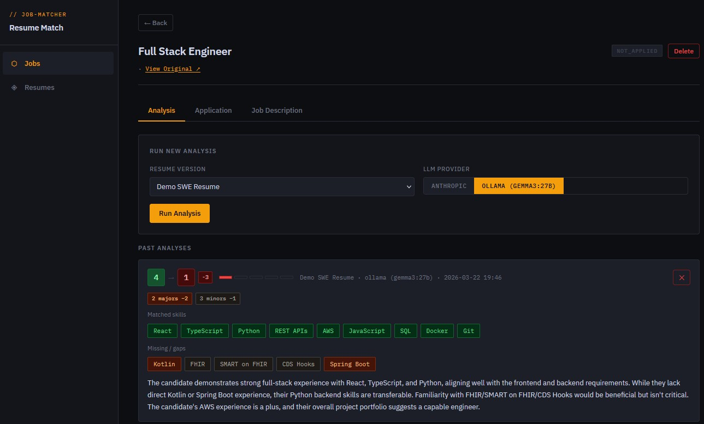
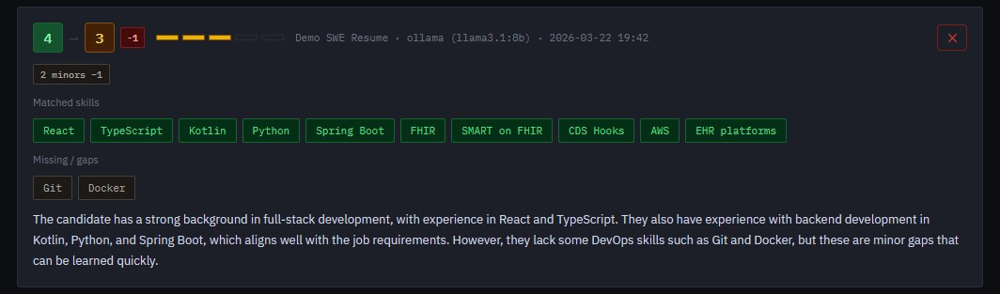
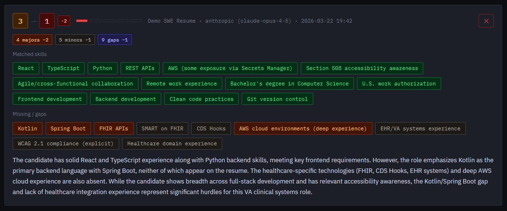

# Job Matcher — Go Version

> Local AI-powered resume-to-job matching and application tracker.
> Single binary — no Python, no venv, no pip install.
> Double-click the `.exe` (Windows) or run `./job-matcher-linux` (Linux).

---

## Screenshots

<div align="center">
  
  <p><em>Launcher — live health checks, model selector, Start / Restart / Stop</em></p>
</div>

<div align="center">
  
  <p><em>Job Tracker — jobs list with score badges and status tags</em></p>
</div>

<div align="center">
  
  <p><em>Ollama (gemma3:27b) — analysis tab with resume selector and LLM provider toggle</em></p>
</div>

<div align="center">
  
  <p><em>Ollama (llama3.1:8b) — same job, lighter penalty, different model perspective</em></p>
</div>

<div align="center">
  
  <p><em>Anthropic (claude-opus-4-5) — penalty pipeline with severity-weighted gaps</em></p>
</div>

---

## What It Does

- Scrapes job postings from a URL (Indeed, LinkedIn, Greenhouse, Workday, etc.)
- Compares each job description against your resume using an LLM
- Scores the match from **1** (poor) to **5** (excellent) with a skill breakdown
- Applies a **penalty pipeline** — detects hard blockers like clearance requirements and experience minimums and adjusts the raw score automatically
- Tracks application status, recruiter contact info, and personal notes
- Supports **Anthropic API** (Claude) or **Ollama** (local models, fully offline)
- All templates, CSS, and JS are embedded inside the binary — no external files needed

**Stack:** Go 1.21 · net/http · SQLite (pure Go) · html/template · go:embed

---

## Requirements

- Go 1.21 or higher → https://go.dev/dl/
- Internet access on first build (to download dependencies)
- Ollama (optional) → https://ollama.com
- Anthropic API key (optional) → https://console.anthropic.com

---

### PowerShell Permission Fix (Windows only)

If you get an execution policy error in PowerShell, run this first:

```powershell
Set-ExecutionPolicy -Scope Process -ExecutionPolicy Bypass
```

---

## First-Time Setup

### Step 1 — Clone

```bash
git clone https://github.com/QuaziBit/job-matcher-go.git
cd job-matcher-go
```

---

### Step 2 — Download dependencies

```bash
go mod tidy
```

This downloads two packages:

| Package | Purpose |
|---|---|
| `modernc.org/sqlite` | Pure Go SQLite driver — no CGo, no C compiler needed |
| `golang.org/x/net` | HTML parser for job scraping |

---

### Step 3 — Run tests

```bash
go test ./...
# or
make test
```

Expected output:

```
ok  github.com/QuaziBit/job-matcher-go/config     0.4s
ok  github.com/QuaziBit/job-matcher-go/launcher   0.9s
ok  github.com/QuaziBit/job-matcher-go/server     0.6s
```

Or use the pretty runner:

```bash
go run ./cmd/testrunner
# or
make test-pretty
```

```
========================================================
  Job Matcher — Test Suite
========================================================

config
  [✓] TestDefaults
  [✓] TestSaveAndLoad
  [✓] TestLoadCreatesDefaultsWhenMissing
  ...

launcher
  [✓] TestCheckSQLite_ExistingFile
  [✓] TestCheckOllama_ServerRunning
  [✓] TestLauncherStartPostSendsConfig
  ...

server
  [✓] TestParseLLMResponse_ValidJSON
  [✓] TestComputeAdjustedScore_BlockerReducesScore
  [✓] TestDBJob_InsertAndFetch
  ...

--------------------------------------------------------
  70/70 passed
```

---

### Step 4 — Run the app

```bash
go run .
# or
make run
```

A browser window opens automatically with the **Launcher** — a config page where you can:

- Review health status of SQLite, Ollama, and Anthropic API
- Change the port, model, or API key before starting
- Click **▶ Start Job Matcher** to launch the main app
- Use **↺ Restart** to switch models without restarting manually
- Use **■ Stop** to shut down the server

Config is saved to `cfg/config.json` in your project directory.

---

## Building Binaries

```bash
make build-windows   # → dist/job-matcher.exe      (Windows amd64)
make build-linux     # → dist/job-matcher-linux    (Linux amd64)
make build-all       # → both
```

On Windows without `make`:

```powershell
go build -ldflags="-s -w" -o dist\job-matcher.exe .
```

The binary is fully self-contained — templates, CSS, and JS are embedded inside it via `go:embed`. No external files are needed to run it.

---

## Usage

### 1. Add your resume

Go to the **Resumes** page → paste your full resume text → give it a label.

```
Example labels: "DevSecOps v2", "Full-Stack General", "Federal Contractor"
```

You can store multiple versions and pick which one to compare per job.

### 2. Add a job

**From a URL** — paste any job posting URL and click Add Job. The app scrapes and parses it automatically.

**By pasting** — switch to the Paste tab, paste the description directly. Useful for Workday or login-gated pages that block scraping.

### 3. Run an analysis

Open a job → **Analysis tab** → pick a resume + LLM provider → **Run Analysis**.

You get:

- A **1–5 raw score** from the LLM
- A **penalty-adjusted score** accounting for hard blockers (clearance, years of experience, mandatory certs)
- **Matched skills** — what aligns
- **Missing skills** — each rated `blocker / major / minor`
- A short **reasoning** summary

Run multiple analyses with different resumes or providers and compare them side by side.

### 4. Track your application

**Application tab** → set status, add recruiter info, and write notes.

| Status | Meaning |
|---|---|
| `not_applied` | Saved for later |
| `applied` | Submitted |
| `interviewing` | In process |
| `offered` | Offer received |
| `rejected` | Closed |

---

## LLM Providers

### Anthropic (default)

Requires `anthropic_api_key` set in the launcher or `cfg/config.json`. Uses `claude-opus-4-5`.
Costs roughly $0.01–0.05 per analysis depending on job description length.
Get a key at: https://console.anthropic.com

### Ollama (local, free, offline)

Runs entirely on your machine — no API key, no cost, no data leaves your box.

```bash
# 1. Install Ollama
#    https://ollama.com/download

# 2. Pull a model
ollama pull llama3.1:8b

# 3. Start the server
ollama serve

# 4. Select the model in the launcher dropdown and click Start
```

**Recommended models:**

| Model | RAM needed | Quality |
|---|---|---|
| `llama3.1:8b` | ~8 GB | Best balance for everyday use |
| `gemma3:27b` | ~32 GB | Near-Anthropic quality |
| `mistral:7b` | ~5 GB | Decent, lightweight |
| `phi3.5:3.8b` | ~4 GB | Fast triage only |

**Recommended workflow:**

- Quick triage → `llama3.1:8b`
- Serious roles → `gemma3:27b`
- Final decision → Anthropic toggle

---

## Scraping Notes

Works out of the box with most public job boards: Indeed, LinkedIn, Greenhouse, Lever, SmartRecruiters, BambooHR.

May not work if the page:

- Requires a login to view the full description
- Renders content entirely via JavaScript (some Workday / iCIMS pages)
- Has aggressive bot detection

**Workaround:** Use the **Paste** tab — copy the job description text from your browser and paste it directly.

---

## Releasing on GitHub

Push a version tag to trigger the release workflow:

```bash
git tag v1.0.0
git push origin v1.0.0
```

GitHub Actions will automatically:

1. Run all tests
2. Build `job-matcher.exe` (Windows amd64)
3. Build `job-matcher-linux` (Linux amd64)
4. Attach both to the GitHub release as downloadable assets

---

## Project Structure

```
job-matcher-go/
├── main.go                      Entry point — loads config, starts launcher
├── config/
│   └── config.go                Load/save cfg/config.json with defaults
├── launcher/
│   ├── launcher.go              Launcher HTTP server — Start/Stop/Restart handlers
│   ├── health.go                DB / Ollama / Anthropic health checks
│   └── template.go              Launcher UI (HTML + JS rendered as Go string)
├── server/
│   ├── server.go                Main app HTTP server, go:embed, template setup
│   ├── handlers.go              All HTTP route handlers (pages + API)
│   ├── analyzer.go              LLM calls (Anthropic + Ollama) + penalty pipeline
│   ├── scraper.go               URL scraper using golang.org/x/net/html
│   ├── database.go              SQLite schema + all queries
│   ├── models.go                Shared structs (Job, Resume, Analysis, etc.)
│   └── embedded/
│       ├── templates/           HTML templates (go:embed into binary)
│       └── static/
│           ├── css/style.css    Dark theme, IBM Plex fonts
│           └── js/app.js        Frontend JS — forms, toasts, tabs, score meters
├── cmd/
│   └── testrunner/main.go       Pretty test output with [✓] / [X]
├── Makefile                     Build, test, and run targets
├── cfg/config.json              Runtime config — auto-created, never committed
├── config.example.json          Config template showing all available fields
├── NOTES.md                     Useful Go commands reference
└── .github/workflows/
    └── release.yml              CI: test + cross-compile + attach to GitHub release
```

---

## Useful Go Commands

### After cloning or changing module path

```bash
go mod tidy       # regenerates go.sum with the new module path
go test ./...     # verify everything still compiles and passes
go run .          # confirm it starts
```

### Cache

```bash
go clean -cache           # clear build cache (compiled packages)
go clean -modcache        # clear module download cache
go clean -cache -modcache # clear both at once
```

### Modules

```bash
go mod tidy               # add missing, remove unused dependencies
go mod download           # download all dependencies to local cache
go mod verify             # check cached deps match go.sum
go get package@version    # add or upgrade a dependency
go get package@none       # remove a dependency
```

### Building

```bash
go build .                                               # build for current OS
GOOS=windows GOARCH=amd64 go build -o dist/app.exe .   # cross-compile to Windows
GOOS=linux   GOARCH=amd64 go build -o dist/app-linux . # cross-compile to Linux
go build -ldflags="-s -w" -o dist/app.exe .             # strip debug info (smaller binary)
```

### Testing

```bash
go test ./...              # run all tests
go test ./... -v           # verbose output
go test ./... -count=1     # disable cache, always re-run
go run ./cmd/testrunner    # pretty [✓] / [X] output
make test                  # alias for go test ./... -count=1
make test-pretty           # alias for go run ./cmd/testrunner
```

### Environment

```bash
go env                     # print all Go environment variables
go env GOPATH              # where modules and cache are stored
go version                 # print installed Go version
go fmt ./...               # format all Go files
go vet ./...               # catch common mistakes
```

---

**Branch: v3-advanced**
This branch builds on v2-advanced and adds Analysis Mode (fast / standard /
detailed), a progress bar with elapsed time tracking, duration and mode
stored per analysis, and dynamic context window resolution for Ollama.

**Local model compatibility:**

- `llama3.1:8b` — works in all modes (fast / standard / detailed)
- `phi3.5:3.8b` — works in all modes (fast / standard / detailed)
- `gemma3:27b` — works in fast and standard modes; detailed mode may take
   15-20+ minutes on consumer hardware, increase `OLLAMA_TIMEOUT` to 2000s+
- `nemotron-3-nano` — not compatible, ignores structured output format
- Anthropic — works reliably in all modes
For the advanced features without Analysis Mode see
[v2-advanced](https://github.com/QuaziBit/job-matcher-go/tree/v2-advanced).
For the stable faster version see
[main](https://github.com/QuaziBit/job-matcher-go/tree/main).

---

## Related

- **Python version** → [github.com/QuaziBit/job-matcher-py](https://github.com/QuaziBit/job-matcher-py)
  Original prototype built with FastAPI. Requires Python 3.10+, pip, and a virtual environment.

---

## License

MIT
